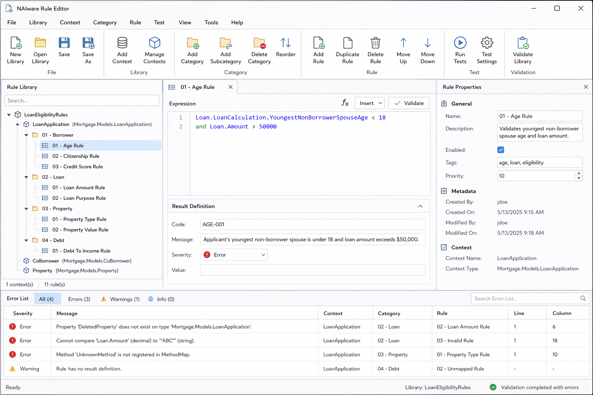

# NAIware Rule Editor — Windows UI Specification

> **Terminology and versioning rule:** This project uses **Library** as the root term for a persisted set of rules. Do not use "catalog" for product/domain naming. Versioning belongs to the **RulesLibrary** as a whole. Individual rule expressions are not versioned and do not maintain expression-level revision history. A context owns categories, categories may contain deeply nested subcategories, and rule expressions are attached at category leaf nodes.


## Cross-Document Consistency Contract

The three specification files describe one connected system and must remain aligned:

| File | Responsibility |
|---|---|
| `rule-model-design.md` | Canonical entity model, runtime contracts, lifecycle states, validation model, persistence abstractions, and design tradeoffs. |
| `system-use-cases.md` | System behavior and runtime flows that operate on the canonical model entities. |
| `windows-ui.md` | Developer-facing Windows tooling that creates, edits, validates, tests, saves, loads, and publishes the same canonical model. |

Shared consistency rules:

1. **Library is the root term**. Do not introduce catalog/catalogue terminology.
2. **RulesLibrary is the versioned aggregate**. Individual Rule Expressions do not have independent versions.
3. **RulesLibrary.State is canonical** for lifecycle behavior. `IsPublished`, when present, is a derived convenience flag and must not conflict with `State`.
4. **RuleContext.QualifiedTypeName is the canonical persisted type binding**. Tooling should populate it from reflected .NET type metadata, preferably using the assembly-qualified CLR type name when available. Runtime context resolution may compare both assembly-qualified name and full type name to support loaded objects.
5. **Rule Categories may be deeply nested**, but Rule Expressions attach only to leaf categories. Non-leaf execution is rejected by default unless descendant leaf execution is explicitly enabled through category execution mode.
6. **Rule Parameters are owned by Rule Contexts** and referenced by Rule Expressions. The Windows UI parameter grid, validation flows, and runtime parameter extraction all operate on `RuleParameterDefinition`.
7. **Rule Result Definition is the match payload** returned when a Rule Expression evaluates true. The consuming application interprets the meaning of the result payload.
8. **Validation findings are not runtime mismatches**. Validation errors/warnings/information are design-time or pre-execution findings; mismatches are valid false expression outcomes; runtime failures are returned as structured `RuleEvaluationError` records.
9. **Windows UI actions must map to model changes and/or system use cases**. The UI does not introduce separate domain concepts that are not represented in the model or use-case flow.




## Overview

The NAIware Rule Editor is a Windows Forms application used to create, edit, validate, save, load, and test rule libraries for the NAIware deterministic rules engine.

The UI is developer-focused. It supports raw rule expressions, DLL-based context type selection, compiler-style validation, and file-based test object hydration.

## Terminology

| Term | Meaning |
|---|---|
| Library | Top-level rule library container |
| Context | A .NET type that rules are evaluated against, such as `Mortgage.Models.LoanApplication` |
| Category | Logical grouping of rule expressions |
| Rule Expression | A raw rule expression plus metadata and result definition |
| Result Definition | Code, message, severity, and optional value returned when a rule matches |

## Main Layout

The application uses a split-pane Windows Forms layout.

- Left panel: Library tree view
- Right panel: selected item editor
- Bottom panel: validation errors, warnings, and information
- Toolbar: file, context, validation, publishing, and testing commands

Recommended structure:

```text
Main Form
└── SplitContainer horizontal
    ├── Left Panel: Library Tree
    └── Right Panel: Selected Item Editor
        └── Context View
            ├── Context Header
            ├── TabControl
            │   ├── Type Binding Tab
            │   ├── Parameters Tab
            │   ├── Validation Tab
            │   └── Test Tab
            └── Action Bar
```


## Library Use Cases

### Create New Library

Creates a new empty library.

### Open Library

Loads a saved library from a JSON file.

### Save Library

Serializes the full library to JSON.

### Save Library As

Saves the current library to a selected JSON file path.

## Context Use Cases and View Layout

The Context View is the primary configuration screen for a Rule Context. It should be organized as a developer-focused configuration workspace rather than a simple list of fields.

The Context View should use a compact header followed by a tabbed editor.

```text
┌──────────────────────────────────────────────────────────────┐
│ Loan Application Context                                     │
│ Mortgage.Models.LoanApplication                              │
│ Status: Valid                                                │
├──────────────────────────────────────────────────────────────┤
│ [ Type Binding ] [ Parameters ] [ Validation ] [ Test ]       │
├──────────────────────────────────────────────────────────────┤
│ Selected tab content                                          │
└──────────────────────────────────────────────────────────────┘
```

### Context Header

The header displays high-level context information:

- Context Name
- Qualified Type Name, persisted as `RuleContext.QualifiedTypeName`
- Context Identity
- Validation Status

The validation status should display as one of:

- Unvalidated
- Valid
- Warning
- Error

This is a context validation status, not the Rules Library lifecycle state.

The header should remain compact and should not contain detailed type or parameter configuration.

### Context Tabs

The Context View should contain the following tabs:

1. Type Binding
2. Parameters
3. Validation
4. Test

---

### Type Binding Tab

The Type Binding tab allows the user to connect the Rule Context to a .NET type.

```text
┌─ Type Binding ────────────────────────────────────────────────┐
│ Assembly Path                                                 │
│ [ C:\Projects\Mortgage.Models\bin\Debug\Mortgage.Models.dll ] │
│ [ Browse DLL... ] [ Reload Types ]                            │
│                                                              │
│ Selected Type                                                 │
│ [ Mortgage.Models.LoanApplication                         v ] │
│                                                              │
│ Qualified Type Name                                           │
│ [ Mortgage.Models.LoanApplication, Mortgage.Models           ] │
└──────────────────────────────────────────────────────────────┘
```

Fields:

- Source Assembly Path
- Selected Type
- Qualified Type Name, persisted as `RuleContext.QualifiedTypeName`
- Description

Actions:

- Browse DLL
- Reload Types
- Copy Qualified Type Name

When the user selects a DLL, the editor reflects over public concrete classes and populates the Selected Type dropdown.

When the user selects a type, the editor updates:

- Context name, if empty
- `RuleContext.QualifiedTypeName`, preferably using the assembly-qualified CLR type name when available
- Reflected type preview
- Available property paths for IntelliSense
- Available parameter mapping candidates

The UI may display a friendly full type name, but the persisted type binding must map to the same `RuleContext.QualifiedTypeName` used by the model and runtime context resolver.

The Type Binding tab should also include a Reflected Type Preview grid.

Recommended Reflected Type Preview columns:

- Property Path
- Property Name
- Data Type
- Nullable
- Declaring Type

Recommended actions:

- Copy Property Path
- Create Parameter From Property
- Insert Property Path Into Rule Expression, when launched from rule authoring

```text
┌─ Reflected Type Preview ──────────────────────────────────────┐
│ Search: [ borrower ]                                         │
│                                                              │
│ Property Path                         Type                   │
│ ───────────────────────────────────────────────────────────  │
│ LoanApplication.Amount                decimal                │
│ LoanApplication.Property.State         string                 │
│ LoanApplication.Borrowers.Count        int                    │
│ LoanApplication.PrimaryBorrower.Age    int                    │
│                                                              │
│ [ Copy Path ] [ Create Parameter ]                           │
└──────────────────────────────────────────────────────────────┘
```

---

### Parameters Tab

The Parameters tab displays all Rule Parameter definitions owned by the selected Rule Context.

```text
┌─ Context Parameters ──────────────────────────────────────────┐
│ Name              Type       Property Path                    │
│ ──────────────────────────────────────────────────────────── │
│ LoanAmount        decimal    LoanApplication.Amount           │
│ PropertyState     string     LoanApplication.Property.State    │
│ BorrowerCount     int        LoanApplication.BorrowerCount     │
│                                                              │
│ [ Add Parameter ] [ Edit ] [ Remove ] [ Auto-Generate ]       │
└──────────────────────────────────────────────────────────────┘
```

Recommended columns:

- Parameter Name
- Qualified Type Name
- Property Path
- Description
- Usage Count

Recommended actions:

- Add Parameter
- Edit Parameter
- Remove Parameter
- Auto-Generate From Selected Type
- Validate Parameter Paths

The Auto-Generate action may create candidate parameters from reflected property paths. Generated parameters should remain editable before saving.

---

### Validation Tab

The Validation tab displays context-specific validation results.

```text
┌─ Context Validation ──────────────────────────────────────────┐
│ ✅ Context type resolved                                      │
│ ✅ 18 property paths discovered                               │
│ ⚠  2 parameters are not used by any rule                       │
│ ❌ 1 parameter points to a missing property path                │
└──────────────────────────────────────────────────────────────┘
```

The summary should include:

- Whether the source assembly can be loaded
- Whether the selected type can be resolved
- Number of reflected property paths discovered
- Number of parameters defined
- Number of parameters used by expressions
- Number of context-specific errors
- Number of context-specific warnings

Detailed validation findings still appear in the global bottom error panel.

---

### Test Tab

The Test tab allows the developer to hydrate a sample object and run rules against the selected context.

```text
┌─ Test Context ────────────────────────────────────────────────┐
│ Test Object File                                              │
│ [ C:\TestData\loan-application.json                       ]   │
│ [ Browse Test File ] [ Hydrate Object ] [ Test Rules ]         │
└──────────────────────────────────────────────────────────────┘
```

Fields:

- Test Object File
- Serializer Type, optional
- Last Hydration Status
- Last Test Run Status

Actions:

- Browse Test File
- Hydrate Object
- Test Rules

Testing should support JSON and XML files initially. Custom serializer support may be configured through a selected serialization assembly and serializer class.

Testing should not require manually entering property values.

## Category Use Cases

### Add Category

Creates a new category under the selected context.

### Add Subcategory

Creates a nested category under the selected category.

### Assign Rule To Category

Rules can be assigned to categories and displayed under the category tree.

Rule Expressions should be assigned only to category leaf nodes. A non-leaf category is an organizational node by default.

If a user attempts to assign a rule to a non-leaf category, the UI should block the assignment or surface a validation error consistent with `RULE_CATEGORY_NOT_EXECUTABLE` / category leaf-node validation.

If a user adds a subcategory beneath a category that already has rules attached, the UI should either require those rules to be moved to a descendant leaf category or allow the change while immediately showing a validation error.


## Rule Authoring

Rules are authored as raw expressions.

Examples:

```text
LoanApplication.Amount > 1000
LoanApplication.Amount > 1000 and LoanApplication.Property.State = "CA"
(LoanApplication.Amount > 1000 and LoanApplication.BorrowerCount > 0) or LoanApplication.Channel = "Retail"
```

The UI does not support translating the rule into plain English. It also does not include a visual rule builder.

## IntelliSense

The editor should support simplified IntelliSense using the selected context type.

Suggested IntelliSense sources:

- Reflected property paths
- Nested properties
- Operators
- Keywords such as `and`, `or`, `true`, `false`
- Registered method names in a future revision

The same reflection metadata should be reused by validation.

## Validation

Validation behaves like a compiler build.

The user clicks **Validate Library**, and the application checks all contexts and expressions.

Validation should detect:

- Context type not found
- Property path not found
- Invalid expression syntax
- Parentheses mismatch
- Type mismatch
- Invalid operator usage
- Missing result definitions
- Duplicate identities
- Rule Expressions attached to non-leaf categories

Validation findings should use compiler-style severities:

| Severity | Meaning |
|---|---|
| Error | Blocks publishing or safe execution. |
| Warning | Indicates a design concern but does not block execution. |
| Information | Provides helpful feedback. |


### Type Compatibility Examples

Invalid:

```text
LoanApplication.Amount > "ABC"
```

Reason:

```text
Cannot compare decimal to string.
```

Valid:

```text
LoanApplication.Amount > 1000
```

### Error Panel

The bottom panel should behave like a Visual Studio error list.

Recommended columns:

- Severity
- Message
- Context
- Category
- Rule
- Expression Id

Double-clicking an error should navigate to the rule.

## Test Module

The test module loads real serialized objects from file.

Supported initial formats:

- JSON
- XML

The Context view can also select a custom serialization assembly and serializer class. The selected class must expose a public `Deserialize(string filePath)` method, either static or instance-based. When configured, the editor uses that method to hydrate the selected serialized file instead of the built-in JSON/XML loader.

The user does not manually enter property values in the initial version.

Testing should invoke the same Rule Processor contract used at runtime. The test request should include the hydrated input object, selected category name, `IncludeDiagnostics = true`, selected `RuleExecutionMode`, and selected `RuleCategoryExecutionMode`.

The default test category execution mode should be `LeafOnly`. If the UI supports testing a non-leaf category, it should expose that as an explicit option such as **Run Descendant Leaf Categories** and pass `RuleCategoryExecutionMode.IncludeDescendantLeaves`.

Workflow:

1. User selects a context or rule.
2. User clicks **Test Rules**.
3. Application asks for a JSON or XML file.
4. Application hydrates the file into the selected context type.
5. Application runs the rules against the hydrated object.
6. Application displays matches, valid mismatches, diagnostics, structured errors, warnings, library version, and snapshot identity.


## UI-to-System Mapping

The Windows Rule Editor is a design-time tool over the Rules Library model.

| UI Action | System Behavior |
|---|---|
| Create New Library | Creates a draft Rules Library. |
| Open Library | Deserializes a Rules Library from JSON. |
| Save Library | Serializes the current draft library. |
| Save Library As | Serializes the current draft library to a selected path. |
| Add Context From DLL | Creates a Rule Context using reflected type metadata. |
| Add Category | Creates a Rule Category under the selected context or parent category. |
| Add Rule Expression | Creates a Rule Expression under the selected context. |
| Assign Rule To Category | Creates a `RuleCategoryExpression` join against a leaf category. |
| Validate Library | Runs full model and expression validation. |
| Test Rules | Hydrates a test object and invokes the Rule Processor with diagnostics enabled. |
| Publish Library | Validates, snapshots, sets `RulesLibrary.State = Published`, and marks the library version immutable. |
| Archive Library Version | Updates the selected immutable version state to Archived through the repository boundary. |
| Deprecate Library Version | Updates the selected immutable version state to Deprecated through the repository boundary. |

## Publish Library

Publishing should validate the full library before creating an immutable Rules Library Version.

If validation errors exist, publishing should be blocked and the validation findings should be displayed in the bottom error panel.

Warnings should not block publishing by default, but the UI may display a confirmation prompt before publishing with warnings.

Publishing sets `RulesLibrary.State = Published`. `IsPublished`, if displayed or serialized, is a derived convenience value and must not conflict with `State`.

Published, deprecated, and archived versions should be treated as immutable in the editor. To change a published version, the user should create a new draft based on that version.


## UI Consistency Matrix

The Windows Rule Editor must remain a design-time tool over the same model and use-case flow described in the other specification files.

| UI Area | Canonical Model / Use Case Alignment |
|---|---|
| Library commands | Operate on `RulesLibrary`, `LibraryVersion`, lifecycle state, repository operations, and SUC-01 / SUC-06 / SUC-17. |
| Context View | Operates on `RuleContext`, `QualifiedTypeName`, `SourceAssemblyPath`, reflected metadata, and SUC-02. |
| Category tree | Operates on `RuleCategory`, `ParentCategoryIdentity`, `ChildCategories`, leaf-node rules, and SUC-03. |
| Rule authoring | Operates on `RuleExpression`, `RuleExpressionParameter`, `RuleResultDefinition`, and SUC-04 / SUC-07. |
| Parameters tab | Operates on `RuleParameterDefinition`, `PropertyPath`, `QualifiedTypeName`, and SUC-05 / SUC-10. |
| Validation panel | Displays `RuleValidationFinding` records with Error, Warning, and Information severity from SUC-16. |
| Test module | Creates a `RuleEvaluationRequest` and displays `RuleEvaluationResult`, including matches, mismatches, diagnostics, errors, warnings, library version, and snapshot identity from SUC-09 through SUC-14 and SUC-18. |
| Publish command | Runs validation and creates an immutable library-level snapshot; it does not version individual expressions. |

Result severity and validation severity are related UI concepts but are not the same data. Result severity belongs to `RuleResultDefinition`; validation severity belongs to `RuleValidationFinding`.

## Future Enhancements

- Syntax highlighting
- Inline error underlines
- More advanced IntelliSense
- Monaco editor hosted through WebView2
- Saved test cases
- Batch test runs
- Performance metrics
